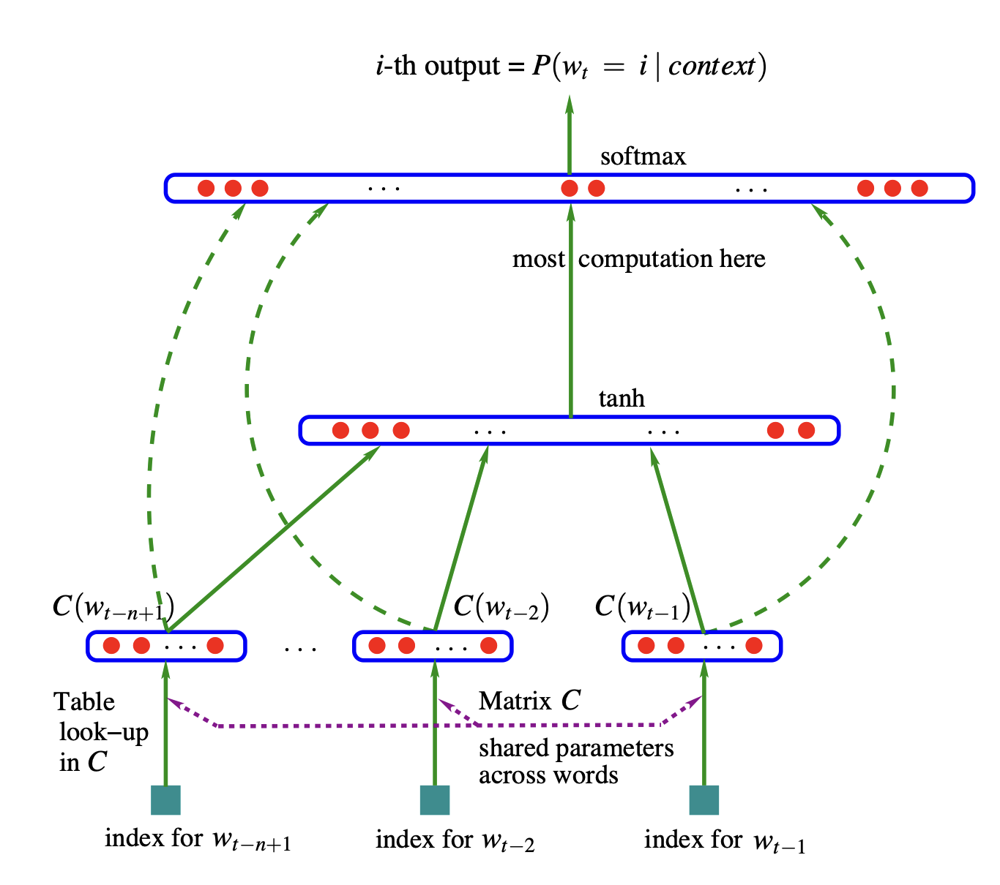
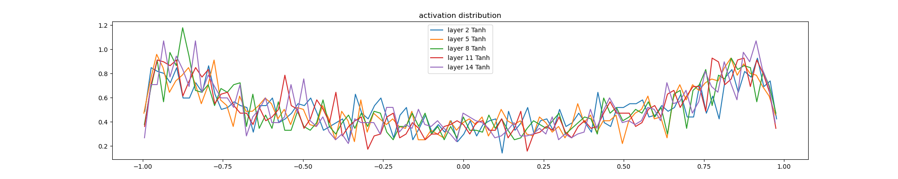
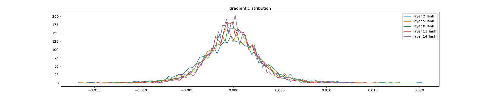
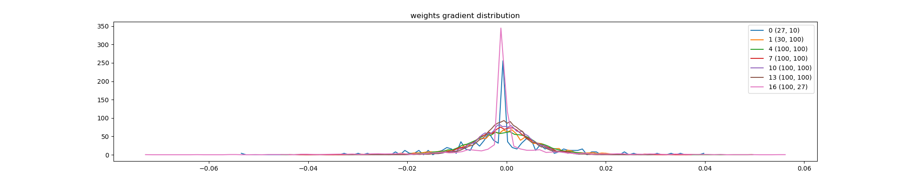
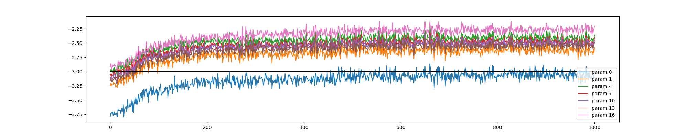

# Learning makemore 
In this series of projects following the lectures of [Andrej Kaparthy](http://www.youtube.com/playlist?list=PLAqhIrjkxbuWI23v9cThsA9GvCAUhRvKZ), I work towards building a Generative Pre-training Transformer (GPT) starting with the [makemore](https://github.com/karpathy/makemore) project. makemore takes one text file as input, where each line is assumed to be one training thing, and generates more things like it. In the first part of the project, we will feed it 32,000 names in then `names.txt` file and produce more names like it. 

## Part 1 
We start by introducing bigram character level language model and train and sample from the model. We evaluate the quality of the model using negative log likelihood loss. We build the models using two different approaches and find the that result for both of them is the same. In the first approach, we count the frequency of all the bigrams and normalize it. In the second approach, we build a linear neural network using `PyTorch` which takes 27 inputs and has 27 output neurons. We do a forward pass to produce the output, backward pass (backpropagation), computing the gradients of the loss function with respect to the model’s parameters by working backward through the network. We use gradient descent algorithm to minimize the loss function. 

In the first part, the names produced by the model are 

```
cexze.
momasurailezityha.
konimittain.
llayn.
ka.
da.
staiyaubrtthrigotai.
moliellavo.
ke.
teda.
ka.
emimmsade.
enkaviyny.
fobspehinivenvtahlasu.
dsor.
br.
jol.
pyawaisan.
ja.
fdinee.
zka.
deru.
firit.
gaikajahahbevare.
kiysthelenaririenah.
```

## Part 2 

In the previous part, we were limited by bigram language model which was using counts and a basic neural network with a single linear layer. In the second part, we follow the technique developed in the [following paper](https://www.jmlr.org/papers/volume3/bengio03a/bengio03a.pdf), which uses this neural architecture: 



We will use a more sophisticated multi-layer perceptron (MLP) character-level language model. Training involves optimizing embeddings, hidden layer weights and biases through backpropagation while minimizing negative log-likelihood loss. To ensure scalability and efficiency, we implemented mini-batch training, learning rate schedules and dataset splits (train, validation, and test). By experimenting with larger embedding dimensions, hidden layers and context lengths, we achieved a validation loss of 2.17, surpassing the bigram model’s best performance of 2.45. Visualization of learned embeddings revealed meaningful clustering of characters based on their behavior in sequences. The names produced by this model are: 

```
carmah.
americkifrimy.
xilita.
halayson.
rah.
bradherric.
kaeli.
ner.
kia.
chaihvik.
leggyn.
bron.
cateegan.
shoine.
livabi.
wazelo.
dearynix.
kaelynn.
deme.
deco.
```

## Part 3 

In this part, we build on the previous part by improving neural network performance and stability. [Kaiming Initialization](https://arxiv.org/abs/1502.01852) method was implemented, in which we scale weights based on the number of input connections to ensure balanced activations and gradient magnitudes across layers, making training more efficient. This is done in order to address the issue of vanishing or exploding gradients. For example, they find for ReLU, scaling the weights by $\sqrt{2 / n_l}$ gives the best results. The factor of 2 appears due to ReLU essentially removing the left half of the input. To further stabilize training, [batch normalization (BN)](https://arxiv.org/abs/1502.03167) was introduced. BN normalizes activations dynamically during training and maintains running statistics for inference, reducing sensitivity to initialization and improving the convergence of deeper networks.

Visualization methods were used to gain insights on activation, gradient, weight gradient and update to data ratio distributions, which can be seen below.

### Forward-Pass Activation Statistics
 
- **Observed**:
  - Without proper initialization, activations in the hidden layers showed undesirable behavior:
    - Activations either shrank toward zero or saturated at extreme values (e.g., ±1 for `Tanh` layers).
    - Saturated activations were more prevalent in deeper layers, reducing gradient flow.
- **Ideal**:
  - Activations should display a roughly Gaussian distribution with:
    - A mean close to zero.
    - A consistent standard deviation across layers (e.g., ~0.65 for `Tanh`).
    - Minimal saturation (ideally &lt; 5% of neurons with values near activation limits like ±1).


### Backward-Pass Gradient Statistics
 
- **Observed**:
  - Improper initialization led to:
    - **Vanishing gradients**: Gradients became too small in earlier layers, rendering them untrainable.
    - **Exploding gradients**: Gradients became excessively large, causing instability.
- **Ideal**:
  - Gradients should maintain a stable distribution across layers:
    - No layer should have disproportionately large or small gradient magnitudes.
    - Gradients should not diminish to zero or grow excessively as they propagate backward.

### Weight and Parameter Distributions
 
- **Observed**:
  - Certain layers, particularly the output layer, had overly large or small weight magnitudes.
  - Imbalances in weight scales led to uneven update rates during training.
  - Gradient-to-data ratio and update-to-data ratio plots highlighted these disparities, showing some layers trained faster or slower than others.
- **Ideal**:
  - Weight distributions should:
    - Have consistent standard deviations across layers, reflecting balanced initialization.
    - Exhibit stable updates relative to their magnitude, ensuring proportional training.

### Update-to-Data Ratios
 
- **Observed**:
  - Improper learning rates or unbalanced initialization caused:
    - Updates that were too small, leading to undertraining.
    - Updates that were too large, causing instability.
- **Ideal**:
  - The update-to-data ratio for parameters should stabilize around `10^-3` (on a log scale):
    - Ensures meaningful updates without destabilizing parameter values.

The results at the end of part 3 are: 

```
carmahfari.
harlin.
mili.
tatyah.
cassie.
rah.
bradheryncia.
qui.
nellara.
chaiivia.
legyn.
ham.
joce.
quintis.
lilah.
jadilyn.
jero.
dearyn.
kai.
eveiluan.
```

## Part 4
