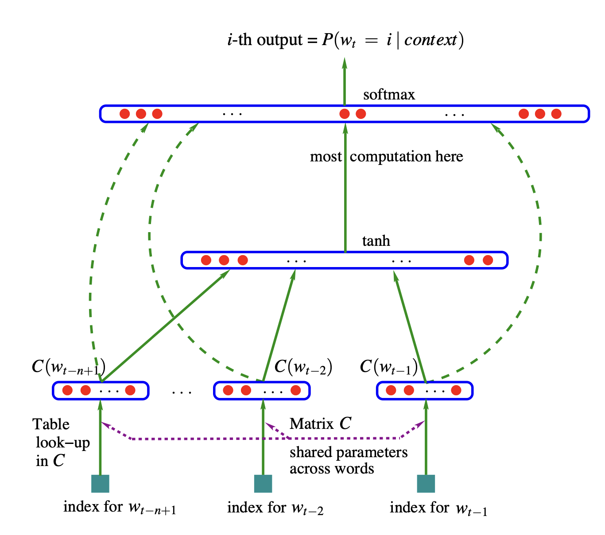

# Learning makemore 
In this series of projects following the lectures of [Andrej Kaparthy](http://www.youtube.com/playlist?list=PLAqhIrjkxbuWI23v9cThsA9GvCAUhRvKZ), I work towards building a Generative Pre-training Transformer (GPT) starting with the [makemore](https://github.com/karpathy/makemore) project. makemore takes one text file as input, where each line is assumed to be one training thing, and generates more things like it. In the first part of the project, we will feed it 32,000 names in then `names.txt` file and produce more names like it. 

## Part 1 
We start by introducing bigram character level language model and train and sample from the model. We evaluate the quality of the model using negative log likelihood loss. We build the models using two different approaches and find the that result for both of them is the same. In the first approach, we count the frequency of all the bigrams and normalize it. In the second approach, we build a linear neural network using `PyTorch` which takes 27 inputs and has 27 output neurons. We do a forward pass to produce the output, backward pass (backpropagation), computing the gradients of the loss function with respect to the model’s parameters by working backward through the network. We use gradient descent algorithm to minimize the loss function. 

In the first part, the names produced by the model are 

```
cexze.
momasurailezityha.
konimittain.
llayn.
ka.
da.
staiyaubrtthrigotai.
moliellavo.
ke.
teda.
ka.
emimmsade.
enkaviyny.
fobspehinivenvtahlasu.
dsor.
br.
jol.
pyawaisan.
ja.
fdinee.
zka.
deru.
firit.
gaikajahahbevare.
kiysthelenaririenah.
```

## Part 2 

In the previous part, we were limited by bigram language model which was using counts and a basic neural network with a single linear layer. In the second part, we follow the technique developed in the [following paper](https://www.jmlr.org/papers/volume3/bengio03a/bengio03a.pdf), which uses this neural architecture: 



We will use a more sophisticated multi-layer perceptron (MLP) character-level language model. Training involves optimizing embeddings, hidden layer weights and biases through backpropagation while minimizing negative log-likelihood loss. To ensure scalability and efficiency, we implemented mini-batch training, learning rate schedules and dataset splits (train, validation, and test). By experimenting with larger embedding dimensions, hidden layers and context lengths, we achieved a validation loss of 2.17, surpassing the bigram model’s best performance of 2.45. Visualization of learned embeddings  revealed meaningful clustering of characters based on their behavior in sequences. The names produced by this model are: 

```
carmah.
americkifrimy.
xilita.
halayson.
rah.
bradherric.
kaeli.
ner.
kia.
chaihvik.
leggyn.
bron.
cateegan.
shoine.
livabi.
wazelo.
dearynix.
kaelynn.
deme.
deco.
```
